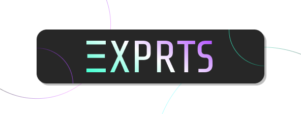

# 👩🎤 Join Agency  ΞXPERTS

<figure><figcaption></figcaption></figure>

## What are we?

We provide **WEB3** **CONSULTANCY** in the areas of:

* ✏️  Product Design
* &#x20;⌨️  Frontend Development
* 📜  Smart Contract Engineering

In all the scenarios, we invest our expertise and time into, and as such, we can be paid in equity, tokens, stable-coins, fiat or some mixture of these depending on the agreement with the end service or entity.

Our website can be found [here](https://agency.developerdao.com/).

## Are you interested in joining?


[Agency **Ξ**XPERTS Contributor Form.](https://airtable.com/appNP5rk00cAmDLUm/shrYeCK5aWiLcpQ9x)


Click on the hyperlink above and fill out an application form. Upon submission, the Agency team will review your application and follow up. All applications are subject to your specific area(s) of expertise, breadth of experience, and the Agency's existing status. The filtering criteria are:

* Demonstrate seniority and expertise in a specific web3 domain.
* Exhibit autonomy in tasks.
* Commit a minimum of 10 hours per week.
* Emphasize teamwork over individual stardom; we don't accommodate stars.

**Leadership qualities are highly valued. Possess an understanding of project capital requirements, budgeting, client interactions, and more. Bring a project/business you are leading in which you want to work with fellow aligned senior D\_D coworkers.**

